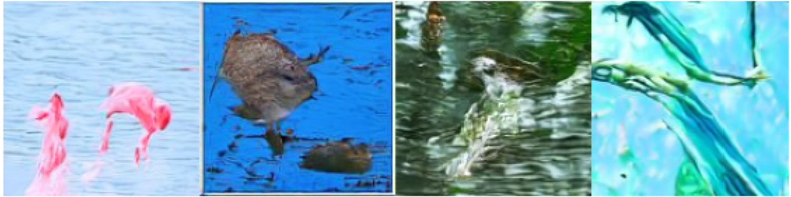
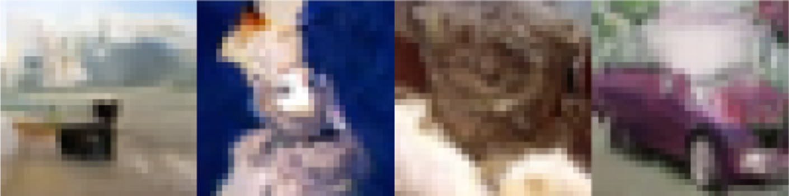
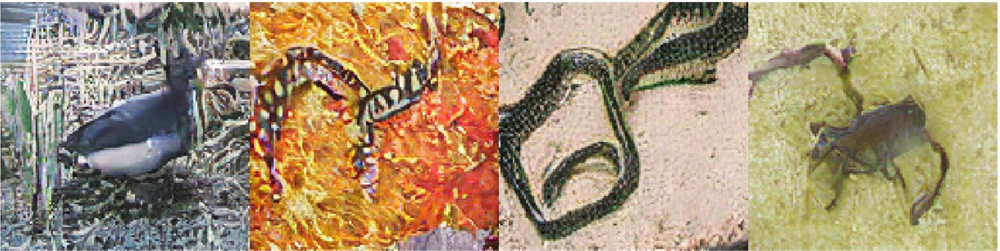

# Diffusion Models for Image Generation

## Overview

This project implements and evaluates state-of-the-art diffusion-based generative models, including:
- **Denoising Diffusion Probabilistic Models (DDPM)**
- **Denoising Diffusion Implicit Models (DDIM)**
- **Latent Diffusion Models (LDM)**

These models are implemented to generate high-quality images efficiently, with a focus on computational scalability and flexibility. The project utilizes various datasets and evaluates the models based on industry-standard metrics such as **Frechet Inception Distance (FID)** and **Inception Score (IS)**.

---

## Key Features

1. **DDPM Implementation:**
   - Progressive noise addition and removal using a U-Net architecture.
   - Training based on a forward diffusion process and reverse noise prediction.

2. **DDIM Scheduler:**
   - Accelerated inference with deterministic sampling.
   - Reduced computational cost without compromising output quality.

3. **Latent Diffusion Models:**
   - Utilizes a Variational Autoencoder (VAE) for efficient latent space representation.
   - Scalable for high-resolution image synthesis.

4. **Classifier-Free Guidance (CFG):**
   - Enhances conditional image generation by interpolating between conditional and unconditional distributions.

5. **Evaluation Metrics:**
   - **FID:** Measures similarity between real and generated data distributions.
   - **IS:** Evaluates the quality and diversity of generated images.

---

## Installation

1. Clone the repository:
   ```bash
   git clone https://github.com/aditya0520/DiffusionModels.git
   cd DiffusionModels
   ```

2. Install the required dependencies:
   ```bash
   pip install -r requirements.txt
   ```

3. Download the datasets:
   - **CIFAR-10** or **ImageNet-128** (used for training and evaluation).

---

## Usage

### Training
Run the training script for any of the models:
```bash
python train.py --use_ddim {True|False} --beta_schedule {linear|cosine|sigmoid}
```

### Evaluation
Evaluate the trained models:
```bash
python inference.py --use_ddim {True|False} --beta_schedule {linear|cosine|sigmoid}
```

---

## Project Structure

- `models/`: Contains implementations of DDPM, DDIM, and LDM.
- `schedulers/`: Implements noise scheduling for DDPM and DDIM.
- `vae/`: Variational Autoencoder for latent diffusion.
- `training/`: Scripts for training the models.
- `evaluation/`: Evaluation scripts for FID and IS metrics.
- `data/`: Utilities for dataset preprocessing and loading.
- `utils/`: Helper functions for training, logging, and visualization.

---

## Datasets

- **CIFAR-10**: 32x32 images of 10 classes.
- **ImageNet-128**: 128x128 images of 100 classes.

Preprocessing includes resizing, normalization, and conversion to PyTorch tensors.

---

## Results

| Experiment | Model | Dataset     | Scheduler       | CFG | FID   | IS    |
|------------|-------|-------------|-----------------|-----|-------|-------|
| A          | DDPM  | ImageNet-128 | Linear Beta    | Yes | 342.2 | -     |
| B          | DDPM  | ImageNet-128 | Cosine Beta    | Yes | 303.1 | -     |
| C          | DDPM  | ImageNet-128 | Linear Beta    | No  | -     | -     |
| D          | DDIM  | CIFAR-10     | Linear Beta    | No  | -     | -     |

---

## Generated Images

### Cosine DDPM with CFG on ImageNet-128


### DDIM on CIFAR-10


### Latent DDPM with CFG on ImageNet-128


---

## Contributors

- **Aditya Aayush** - Implementation of DDPM and related experimentation.
- **Yash Jaiswal** - Implementation of DDIM and optimization research.
- **Priya Lalwani** - Literature review and report preparation.

---

## References

1. Ho, J. et al., "Denoising Diffusion Probabilistic Models", NeurIPS, 2020.
2. Song, J. et al., "Denoising Diffusion Implicit Models", ICLR, 2021.
3. Rombach, R. et al., "High-Resolution Image Synthesis with Latent Diffusion Models", CVPR, 2022.

---

